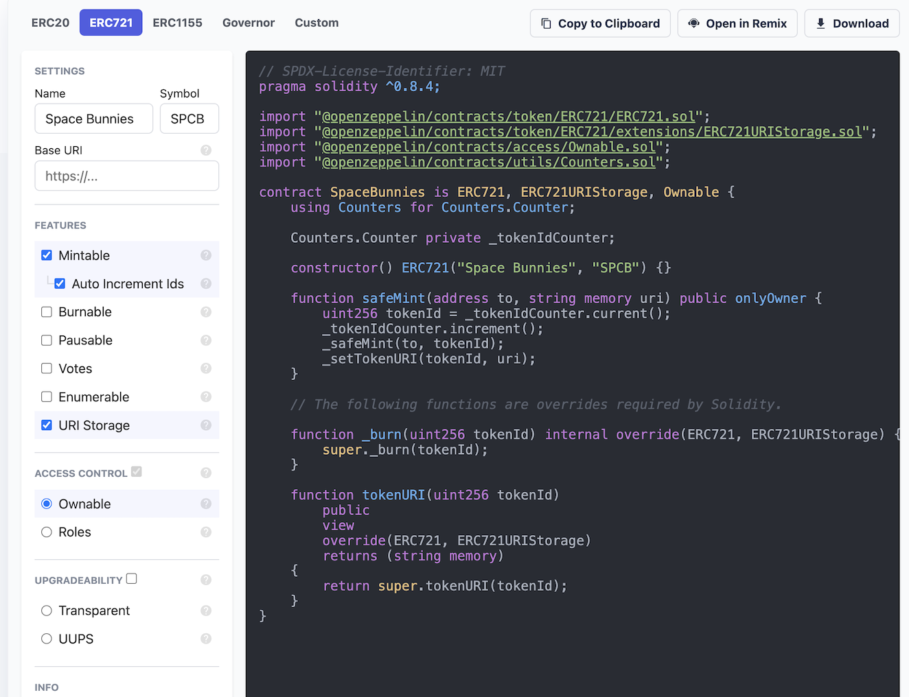

# Hands-on Lab: Create an NFT Collection with Fireblocks

## Overview

In this lab, we will be creating our very own NFT collection and minting a new NFT to view on OpenSea & Rarible - all while using Fireblocks to securely store our new collection.

**Pre-requisites**
1. Access to a Fireblocks Workspace (one will be provided to you at SPARK 22)
2. NodeJS (latest version preferable)
3. An IDE or text editor ([Visual Studio Code](https://code.visualstudio.com/) is a great choice, or Sublime)


## Lab Steps - Follow Along!

Follow the steps below, although we also encourage you to experiment and deviate from the normal path and explore. We've also included some "extra credit questions" in each step that you can google to read more about topics we cover here.

If you ever get stuck, you can refer to the [Github repo](https://github.com/Spark22Labs/Spark22-Web3-Workspace-Automation-Lab) where the `lab` directory contains an entire working project that you can reference.

And of course, if you have any questions - let a Fireblocks staff member know and we'll help out.

### Step 1: Install Hardhat and Initialize Project
To start, let's create a project directory to work in. This will be the only directory we'll work in for this lab, and will contain all our files and NPM packages.

```
cd ~/<someplace>
mkdir spark22-web3-lab
cd spark22-web3-lab
```

Next, let's install the Hardhat package.

```
npm install --save-dev hardhat
```

Once successfully installed, let's initialize a new Hardhat project using the Hardhat CLI. This will create a boilerplate project for us with a set structure of directories and configuration files.

```
npx hardhat
```

You should see a menu like this:

```
888    888                      888 888               888
888    888                      888 888               888
888    888                      888 888               888
8888888888  8888b.  888d888 .d88888 88888b.   8888b.  888888
888    888     "88b 888P"  d88" 888 888 "88b     "88b 888
888    888 .d888888 888    888  888 888  888 .d888888 888
888    888 888  888 888    Y88b 888 888  888 888  888 Y88b.
888    888 "Y888888 888     "Y88888 888  888 "Y888888  "Y888

👷 Welcome to Hardhat v2.10.1 👷‍

? What do you want to do? … 
❯ Create a JavaScript project
  Create a TypeScript project
  Create an empty hardhat.config.js
```

We will select the **JavaScript project** and hit enter.
1. Select the current directory as your project base
2. Type "y" when asked to add a `.gitignore` file
3. Type "y" when asked to install this sample project's dependencies with npm

🎉 Now we have a new Hardhat project!

**Extra Credit Questions**
* What is Hardhat?


### Step 2: Create our ERC721 collection - Space Bunnies

We'll now create our own NFT collection based on the popular ERC721 standard. Our collection will be called... "Space Bunnies", which will contain unique images of our furry friends in space, doing space things.

Before we can start minting our new NFTs however, we first need to deploy an Ethereum smart contract to actually create our collection. Luckily, the ERC721 standard is very common and there are some great tools to help us do this pretty easily.

Let's use the Contracts Wizard by OpenZeppelin, which is an interactive, browser-based wizard to generate our smart contract file, written in Solidity.

1. Navigate to the [OpenZeppelin Contracts Wizard](https://wizard.openzeppelin.com/#erc721) for ERC721, and select the following boxes. We'll intentionally keep the contract simple to reduce complexity and gas fees.



Make sure to:
Type in Space Bunnies in the Name filed under Settings
Type in SPCB under the Symbol field under Setting

Check the following boxes:
- Mintable
- Auto increment ids
- URI Storage
- Ownable


2. Create a new file, **"spacebunnies.sol"**  in your project directory: `spark22-web3-lab/contracts/spacebunnies.sol`

3. Copy the generated Solidity code from the OpenZeppelin Contracts Wizard into `spacebunnies.sol` and save your file

4. In order to run the generated code, we will also need to install the OpenZeppelin `contracts` package from NPM. 
In your project directory, run:

```
npm install @openzeppelin/contracts
```

**Extra Credit Questions**
* What is ERC721?
* What is an Ethereum smart contract?

### Step 3: Setup Hardhat for Fireblocks
#### 1. Install the Hardhat Fireblocks plugin

```
npm install @fireblocks/hardhat-fireblocks
```

#### 2. Replace the contents of your existing Hardhat configuration file, `hardhat.config.js`, with the following:

```javascript
require("@nomicfoundation/hardhat-toolbox");
require("@fireblocks/hardhat-fireblocks");

/** @type import('hardhat/config').HardhatUserConfig */
module.exports = {
  solidity: "0.8.9",
  networks: {
    goerli: {
      url: "https://rpc.ankr.com/eth_goerli",
      fireblocks: {
        privateKey: process.env.FIREBLOCKS_API_PRIVATE_KEY_PATH,
        apiKey: process.env.FIREBLOCKS_API_KEY,
        vaultAccountIds: "18",
      }
    },
  }
};
```

Note: We have already set up a vault account on Fireblocks for you (vault_id 18) that has some pre-funded Goerli ETH.

What are we doing here?
1. Importing the Fireblocks Hardhat plugin, so that we can use a Fireblocks vault as our secure storage
2. Specifying the Ethereum Goerli Testnet, which we will be using Ankr.com to access via their API

**Extra Credit Questions**
1. What is Goerli Testnet?
2. What is Ankr.com?


### Step 4: Deploying our collection
1. Since we don't need the `Lock.sol` file that came with our Hardhat boilerplate template, we can delete it.

```
rm spark22-web3-lab/contracts/Lock.sol
```

2. Compile the `spacebunnies.sol` file

```
npx hardhat compile
```

3. Next, we will replace the contents of the `deploy.js` script, with the following:

```javascript
// We require the Hardhat Runtime Environment explicitly here. This is optional
// but useful for running the script in a standalone fashion through `node <script>`.
//
// You can also run a script with `npx hardhat run <script>`. If you do that, Hardhat
// will compile your contracts, add the Hardhat Runtime Environment's members to the
// global scope, and execute the script.
const hre = require("hardhat");

async function main() {
  const SpaceBunnies = await hre.ethers.getContractFactory("SpaceBunnies");
  const spaceBunnies = await SpaceBunnies.deploy();

  await spaceBunnies.deployed();

  console.log("SpaceBunnies deployed to:", spaceBunnies.address);
}

// We recommend this pattern to be able to use async/await everywhere
// and properly handle errors.
main().catch((error) => {
  console.error(error);
  process.exitCode = 1;
});
```

4. Finally, let's deploy our contract to the Ethereum Goerli Testnet:

```shell
npx hardhat run --network goerli scripts/deploy.js 
```

This should take a couple of minutes to run, if everything was configured correctly. Once the deploy script has finished running, you should see a similar message if the contract was deployed successfully. Congrats!

```
SpaceBunnies deployed to: <contract_address>
```
 
### (Optional) Step 4.5: Verifying the transaction
We can further verify our contract by checking the Fireblocks console and [Etherscan for Goerli Testnet](https://goerli.etherscan.io/).

1. Login to your Fireblocks workspace. On the transactions tab, you should see the latest transaction was of type "Contract call". Next, copy the deposit address for your assigned vault name that contains your `ETH_TEST3` (Goerli) tokens from the "Assets" link on the left navigation pane.

2. Paste your address in [Etherscan (Goerli)](https://goerli.etherscan.io/) and you should be able to see the latest transaction marked as "Contract Creation" - with the same contract address that Hardhat provided in the previous step. You can also click on the transaction hash to further inspect it.

### Step 5: Find the perfect NFT image
The fun part! Now we get to choose our space bunny image that we want to deploy to our newly created collection on the Ethereum (testnet) blockchain. Since our NFT images should be unique, an AI-generated image is a good way to source this.

1. Navigate to craiyon.com, an AI image generator, and type in the keywords **"space bunnies"**. After waiting a couple of minutes for Craiyon to do its magic, save your favorite image of a space bunny by clicking on it and "Right Click>Save Image As".

We will use this image to mint our NFT in the next step, so choose wisely!

2. Upload your selected image by dragging it into [ImgBB](https://imgbb.com/), a free image hosting site

3. Once uploaded, right-click and "show image in new tab" to grab the direct link to the JPG (i.e. the URL should end in ".jpg", eg. https://i.ibb.co/m8fsvgC/spcb-6.jpg)

Note that we're using an image host here for convenience, but another alternative would be to use a decentralized filesystem such as the [IPFS](https://docs.ipfs.tech/) protocol to store our image on-chain.

### Step 6: Mint our NFT
#### 1. Create a new `mint.js` file in the `scripts` directory: `scripts/mint.js`. Add the following code:

```javascript
// We require the Hardhat Runtime Environment explicitly here. This is optional
// but useful for running the script in a standalone fashion through `node <script>`.
//
// You can also run a script with `npx hardhat run <script>`. If you do that, Hardhat
// will compile your contracts, add the Hardhat Runtime Environment's members to the
// global scope, and execute the script.
const hre = require("hardhat");
const DatauriParser = require('datauri/parser');
const parser = new DatauriParser();

async function main() {
  const spaceBunniesAddress = "<CONTRACT_ADDRESS>";
  const signer = await hre.ethers.getSigner()
  const signerAdderss = await signer.getAddress()
  const spaceBunnies = await hre.ethers.getContractAt("SpaceBunnies", spaceBunniesAddress, signer);
  const tokenData = {
    "name": "SpaceBunny #1",
    "image": "<IMAGE_URL>",
  }

  const tokenURI = parser.format('.json', JSON.stringify(tokenData)).content
  
  const tx = await spaceBunnies.safeMint(signerAdderss, tokenURI);
  await tx.wait()

  console.log("A new Space Bunny NFT has been minted to:", signerAdderss);
  // console.log("tokenURI:", await spaceBunnies.tokenURI(0))
}

// We recommend this pattern to be able to use async/await everywhere
// and properly handle errors.
main().catch((error) => {
  console.error(error);
  process.exitCode = 1;
});
```

What are we doing here?
1. Replace `CONTRACT_ADDRESS` in `spaceBunniesAddress` with the eth address from the last deploy step
2. Replace `<IMAGE_URL>` in `tokenData` with the link to your uploaded Space Bunny JPEG

#### 2. Deploy the Mint Script
Run the `mint.js` script:

```
npm install datauri     # we use the `datauri` NPM module in the mint.js script
npx hardhat run --network goerli scripts/mint.js
```

This should again take a couple of minutes to run. Once finished successfully, you should see the following output:

```
A new Space Bunny NFT has been minted to: <eth_address>
```

Congrats on minting your very first NFT!

### Step 7: Profit!

Now that we have our very own Space Bunny NFT, let's verify it on both Fireblocks, as well as Rarible (NFT marketplaces).

**Note: For this step, you will need Fireblocks Console UI access. Please tell a Fireblocks Staff member once you reach this step, and they will help you login.**

1. Login to your Fireblocks workspace to see the last transaction was completed successfully. It should be of type "Contract Call".

2. Install the [Fireblocks Chrome Extension](https://chrome.google.com/webstore/detail/fireblocks-defi-browser-e/ffoagjcmdplcadogknepbjebconcjjjb) from the Google Chrome Extension store. If you need more information, you can read [this Help Center](https://support.fireblocks.io/hc/en-us/articles/5403962226332-Connecting-to-Web3-using-the-Fireblocks-Chrome-Extension) article (must be able to login to Fireblocks to view).

Note that you will have to either disable or uninstall the Metamask extension if you have that installed for the Fireblocks Chrome Extension to work correctly. You can also create a temporary new Google Chrome profile just for this lab if you want to install the extension there.

3. Now we can navigate to the [Rarible Testnet](https://testnet.rarible.com/)) and connect to Fireblocks by selecting "Metamask" on the wallet icon on top right hand corner. You will have to authorize OpenSea or Rarible to connect to your wallet by signing the transaction that pops up.

4. Once authorized (the Fireblocks Chrome Extension should say "connected"), click on your OpenSea or Rarible profile icon and select "My Collections".

From here, you can view your newly minted NFT in our Space Bunnies collection, and transfer it to any other wallet.
